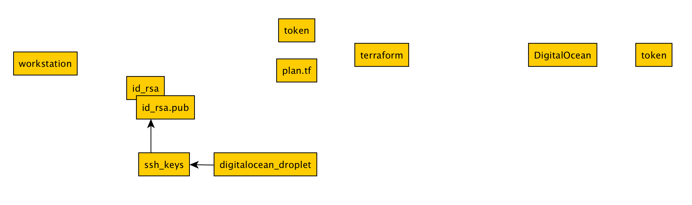

# Terraform DigitalOcean

> Exercises with Terraform and DigitalOcean

## Todos

* provision droplet with ansible
* practice locally with docker because it's faster

## Links

* https://www.yworks.com/yed-live/

## Overview



## Usage example

```
ssh-keygen -q -b 2048 -t rsa -N '' -f id_rsa
export TF_VAR_do_token="$(lpass show --notes do_token)"
terraform init
terraform plan
terraform apply -auto-approve
terraform state show digitalocean_droplet.web
ip=$(terraform state show digitalocean_droplet.web | awk '/ipv4_address/ { print $NF }')
ssh-keyscan $ip >> ~/.ssh/known_hosts
ssh -i id_rsa root@$ip echo hello world
terraform destroy -force
```

## List droplets

```
curl -s -X GET -H 'Content-Type: application/json' -H "Authorization: Bearer $(lpass show --notes do_token)" https://api.digitalocean.com/v2/droplets | jq '.'
```
